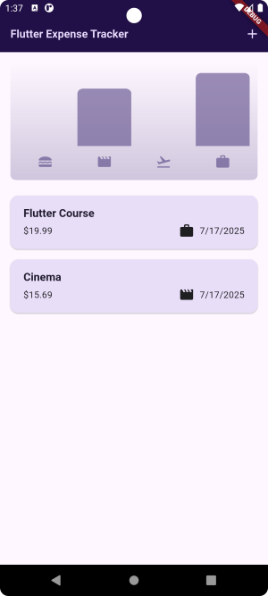
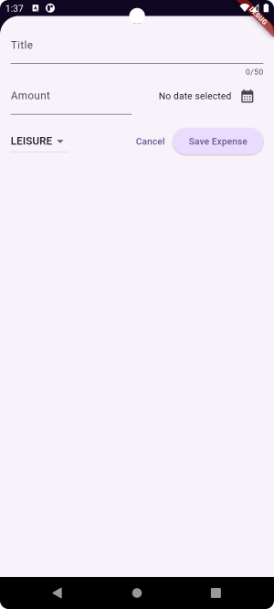
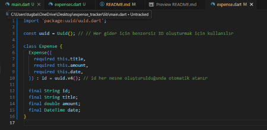
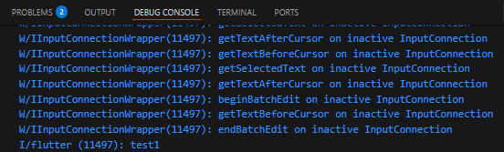
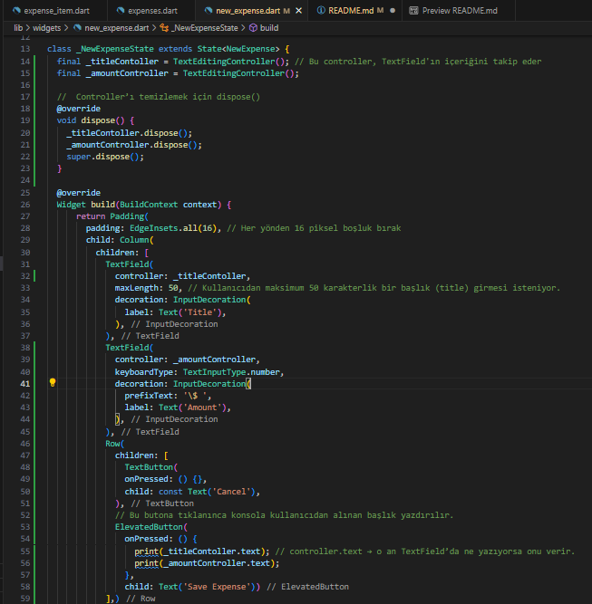
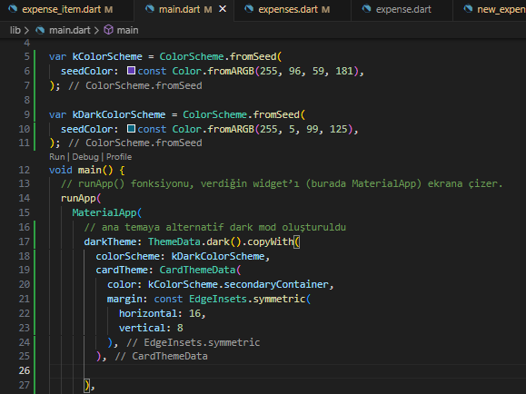

# EXPENSE TRACKER
Bu mobil uygulama, kullanıcıların günlük harcamalarını kolayca kaydedebilecekleri, düzenleyebilecekleri ve analiz edebilecekleri kapsamlı bir gider takip sistemidir. Kullanıcılar, her harcamaya ait başlık, miktar, kategori ve tarih bilgilerini girebilir; kayıtlı harcamalar liste görünümünde detaylı şekilde görüntülenebilir. Ayrıca harcamalar kategorilere göre gruplandırılarak grafiksel (chart) olarak da sunulur.


 


## Dosya Yapısı
```css
lib/
├── models/
│   └── expense.dart
├── widgets/
│   ├── chart/
│   │   ├── chart.dart
│   │   └── chart_bar.dart
│   ├── expenses_list/
│   │   ├── expenses_list.dart
│   │   └── expense_item.dart
│   ├── expenses.dart
│   └── new_expense.dart
└── main.dart
```

### 📄 main.dart
Bu dosya uygulamanın başlangıç noktasıdır. runApp() fonksiyonu ile uygulama başlatılır ve MaterialApp widget’ı çağrılarak genel tema ayarları yapılır. Tema içinde ColorScheme, AppBar, Card, Text, ElevatedButton gibi bileşenlerin görünümü özelleştirilmiştir. Uygulamanın ana ekranı olarak Expenses adlı widget tanımlanmıştır. Bu yapı sayesinde uygulama başlatıldığında doğrudan gider listesinin bulunduğu ana ekrana yönlendirilir.

### 📄 widgets/expenses.dart
Bu dosya, kullanıcı arayüzünün ana ekranını temsil eder. İçerisinde örnek birkaç harcama (Expense) tanımlıdır ve bu harcamalar bir liste şeklinde saklanır. Kullanıcı yeni bir gider eklemek istediğinde ekranın alt kısmından kayan bir form açılır (showModalBottomSheet). Ayrıca, harcama silindiğinde geri alma (undo) işlemini sağlayan bir SnackBar kullanılır. Eğer liste boşsa bilgilendirici bir metin gösterilir; harcamalar varsa liste olarak gösterilir. Bu yapı, uygulamanın dinamik ve kullanıcı etkileşimli olmasını sağlar.

### 📄 widgets/new_expense.dart
Bu dosyada, kullanıcının yeni bir gider ekleyebileceği form yapısı yer alır. Başlık, miktar, kategori ve tarih bilgileri kullanıcıdan alınır. TextField, DropdownButton, IconButton ve DatePicker gibi bileşenlerle kullanıcıdan veri toplanır. Girişlerin doğruluğu kontrol edilir ve eksik ya da hatalı bir veri varsa kullanıcıya hata mesajı (AlertDialog) gösterilir. Geçerli bilgilerle bir Expense nesnesi oluşturularak, üst seviyedeki bileşene iletilir. Böylece listeye yeni bir harcama eklenmiş olur.

### 📄 widgets/expenses_list/expenses_list.dart
Bu dosya, harcama listesini oluşturan widget’tır. Harcamalar, kaydırılabilir bir liste (scrollable list) biçiminde ListView.builder ile gösterilir. Liste elemanları tek tek ExpenseItem widget’ı olarak oluşturulur. Her öğe Dismissible widget ile sarmalanmıştır; bu sayede kullanıcı öğeyi kaydırarak silebilir. Silme işlemi gerçekleştiğinde, ilgili fonksiyon tetiklenerek listeden öğe kaldırılır. Kullanıcı etkileşimine açık bir liste tasarımı sunar.

### 📄 widgets/expenses_list/expense_item.dart
Bu dosya, tek bir harcama bilgisini temsil eden görsel kart yapısını tanımlar. Kartın içinde harcamanın başlığı, miktarı, tarihi ve kategoriye göre bir ikon gösterilir. Görsellerin temaya uygunluğu ve okunabilirliği için stil düzenlemeleri yapılmıştır. ExpenseItem, liste içinde kullanılan küçük bir bileşen olsa da, harcama bilgilerinin net ve şık biçimde sunulmasını sağlar.

### 📄 widgets/chart/chart.dart
Bu dosya, tüm harcamaların kategorilere göre görsel olarak dağılımını gösteren genel grafik widget’ıdır. Her kategori için ilgili harcamalar ExpenseBucket sınıfı ile gruplanır. Grafik, bar çizgilerinden oluşur ve kullanıcının hangi kategoriye ne kadar harcama yaptığını kolayca görmesini sağlar. Bu dosya, verilerin görselleştirilerek analiz edilmesini sağlar.

### 📄 widgets/chart/chart_bar.dart
Bu dosya, grafikteki her bir çubuğu (bar) temsil eder. Barlar belirli bir kategoriye karşılık gelir ve yüksekliği, o kategoriye ait harcama miktarını temsil eder. Harcama oranı yüzdeye göre hesaplanır ve bar yüksekliği bu değere göre ayarlanır. Bu sayede kullanıcı, görsel olarak hangi kategoriye daha çok harcama yaptığını anlayabilir.

### 📄 models/expense.dart
Bu dosya, uygulamada kullanılan Expense model sınıfını tanımlar. Her harcama için başlık, tutar, tarih ve kategori bilgileri saklanır. Her harcamaya benzersiz bir id atanır (uuid ile). Ayrıca, tarih biçimlendirme (formattedDate) işlemleri bu sınıf içinde yapılır. Enum (Category) tanımı sayesinde kategorilere sabit değerler atanmıştır. Harcamalar bu yapı üzerinden tanımlanır ve yönetilir.

## Starting
Başlangıç olarak, main.dart dosyasında MaterialApp ile uygulamanın başlangıç noktası tanımlandı ve Expenses adlı bir StatefulWidget ana sayfa olarak ayarlandı. Expenses sayfasında şimdilik yalnızca iki metin (The chart, Expenses list...) gösterilerek grafik ve harcama listesinin yer alacağı alanlar belirtildi. 

 
   
 

## Adding an Expense Data Model with a Unique ID & Exploring Initializer Lists
Expense sınıfı oluşturuldu.
- id: Benzersiz kimliği
- title: Başlığı (örneğin "Market alışverişi")
- amount: Harcanan tutar
- date: Harcama tarihi

Bu sınıf, kullanıcıların yaptığı harcamaları başlık, miktar ve tarih bilgileriyle temsil eder. Her harcama için otomatik olarak benzersiz bir kimlik (id) oluşturulur. Bu yapı, gider listesinin yönetilmesi ve her giderin kolayca takip edilebilmesi için temel sağlar.

 


## Intoducing Enums

Expense nesnelerine de ait olması gereken bir bilgi eksiktir ve bu da bir giderin ait olduğu kategoridir. Bu nedenle
Expense sınıfında kategori bilgilerini de saklamak istiyoruz.

Neden String türünde değil de enum şeklinde sakladık? 

Expense nesnelerinde kategori bilgisini saklamak için String yerine enum (enumeration) yapısını kullanmak, yazılım açısından daha güvenli ve doğru bir yaklaşımdır. Çünkü enum, sadece önceden tanımlanmış sabit değerleri alabilir ve bu da yazım hatalarını önler. Örneğin Category.food gibi bir kullanımda hem yanlış yazım riski ortadan kalkar hem de uygulama daha tutarlı hale gelir.

String türü kullanılsaydı, "food", "Food" veya "FOOD" gibi farklı yazımlar hataya neden olabilirdi. 

 

## Creating Dummy Data
Çıktı görebilmek için birkaç dummy data eklendi.

 

## Efficiently Rendering Long Lists with ListView
ExpensesList widget’ının amacı, dışarıdan aldığı gider listesini (List<Expense>) ekranda kaydırılabilir şekilde listelemek ve her gideri kullanıcıya görsel olarak sunmaktır.
Column gibi sabit bir yapı yerine, dinamik ve performanslı bir yapı olan ListView.builder kullanılır.

 

## Using Lists Inside of Lists

 
   
 

## Creatin a Custom List Item with the Card & Spacer Widgets
Yalnızca giderlerin başlıkların çıktısını alıyoruz, bunun yerine ilgili tüm gider bilgilerin çıktısını almak istiyoruz.

ExpenseItem widget’ı, tek bir gider bilgisini kart yapısıyla kullanıcıya sunmak amacıyla tasarlanmıştır. Bu widget, başlık, tutar ve tarih gibi bilgileri düzenli şekilde göstererek gider listesinin okunabilirliğini artırır.

   
 

## Using Icons & Formatting Dates
Expense nesnesinin DateTime türündeki date özelliğini okunabilir kıllalım

```
DateTime.now().toString() 
```
gibi doğrudan yazdırırsan şu tarz bir çıktı verir: "2025-07-11 15:43:12.134979"

``` intl ``` paketindeki ```DateFormat.yMd()``` ile bu tarihin çıktısı: "7/11/2025" gibi sade ve daha kolay anlaşılabilir olur

   
  


## Setting an AppBar with a Title & Actions

App bar ekleyelim    
  


## Adding a Modal Sheet & Understanding Context

'+' butonunu aktifleştirelim

  


## Handling User (Text) Input with the TextField Widget 
Alt sayfada gösterilmesi gereken gerçek widget'ı ekleyelim

NewExpense widget'ı kullanıcıdan yeni bir expense girişi almak için bir form alanı oluşturur. Şu anda yalnızca harcama başlığını yazmak için bir TextField içeriyor.

  


## Getting User Input on Every Keystroke
  



## Letting Flutter do the Work with TextEditingController
aynı işlevi dshs profösyonel haliyle yapalım  


## Adding a New Input
Amount alanı ekleyelim   
  


## Closing The Modal Manually
Cancel butonunu aktifleştirelim  


## Showing a Date Picker
Tarih girişi yapabilmek için alan eklendi   

   


## Working with "Futures" for Handling Data from the Future
Seçilen tarihi nasıl saklayabiliriz?   


   


## Adding a Dropdown Button
Kategori için açılır menü ekleyelim  
     


## Combining Conditions with AND and OR Operators
“Save Expense” butonuna basıldığında girilen veri geçerli mi değil mi kontrol edelim.   


## Validating User Input & Showing an Error Dialog
Kullanıcı hatalı bilgi girdiğinde (örneğin boş başlık, negatif tutar veya tarih seçilmemişse), uygulama uyarı penceresi (popup) göstersin.

  


## Saving New Expenses


  
   
  

## Creating a Fullscreen Modal
  
   
  

## Using the Dismissible Widget for Dismissing List Items
Harcamaları sağa veya sola kaydırarak silebiliyoruz.  
   
  

  

## Showing & Managing "Snackbars"
Silinen expense'leri geri alabiliyoruz ve hiç expense eklenmemişse sayfada bir yazı olacak
  

  

## Getting Started with Theming
    
  

## Setting & Using a Color Scheme
    
  


## Setting Text Themes
    

    

## Adding Dark Mode
telefonu dark mode'a aldığımızda hata alıyoruz    
    
    
sorunu kart temamı açık temadan koyu temaya kopyalayarak çözeceğim   
    
    
diğer stiller artık güzel gözükmüyor bunun nedeni de oluşturduğumuz renk şemasının belirli bir seed color kullanmasıdır
    


## Using Another Kind of Loop (for-in)
chart için expense.dart dosyasına yeni bir sınıf ekleyelim    
belirli bir kategorideki tüm harcamaları tek bir liste altında toplayarak o kategorideki toplam tutarı hesaplacağız


## Adding Alternative Constructor Functions & Filtering Lists


## Adding Chart Widgets
lib -> widgets klasörü içine chart klasörü oluşturdum ve içine 2 dosya ekledim:    
chart.dart
``` dart
import 'package:flutter/material.dart';

import 'package:expense_tracker/widgets/chart/chart_bar.dart';
import 'package:expense_tracker/models/expense.dart';

class Chart extends StatelessWidget {
  const Chart({super.key, required this.expenses});

  final List<Expense> expenses;

  List<ExpenseBucket> get buckets {
    return [
      ExpenseBucket.forCategory(expenses, Category.food),
      ExpenseBucket.forCategory(expenses, Category.leisure),
      ExpenseBucket.forCategory(expenses, Category.travel),
      ExpenseBucket.forCategory(expenses, Category.work),
    ];
  }

  double get maxTotalExpense {
    double maxTotalExpense = 0;

    for (final bucket in buckets) {
      if (bucket.totalExpenses > maxTotalExpense) {
        maxTotalExpense = bucket.totalExpenses;
      }
    }

    return maxTotalExpense;
  }

  @override
  Widget build(BuildContext context) {
    final isDarkMode =
        MediaQuery.of(context).platformBrightness == Brightness.dark;
    return Container(
      margin: const EdgeInsets.all(16),
      padding: const EdgeInsets.symmetric(
        vertical: 16,
        horizontal: 8,
      ),
      width: double.infinity,
      height: 180,
      decoration: BoxDecoration(
        borderRadius: BorderRadius.circular(8),
        gradient: LinearGradient(
          colors: [
            Theme.of(context).colorScheme.primary.withOpacity(0.3),
            Theme.of(context).colorScheme.primary.withOpacity(0.0)
          ],
          begin: Alignment.bottomCenter,
          end: Alignment.topCenter,
        ),
      ),
      child: Column(
        children: [
          Expanded(
            child: Row(
              crossAxisAlignment: CrossAxisAlignment.end,
              children: [
                for (final bucket in buckets) // alternative to map()
                  ChartBar(
                    fill: bucket.totalExpenses == 0
                        ? 0
                        : bucket.totalExpenses / maxTotalExpense,
                  )
              ],
            ),
          ),
          const SizedBox(height: 12),
          Row(
            children: buckets
                .map(
                  (bucket) => Expanded(
                    child: Padding(
                      padding: const EdgeInsets.symmetric(horizontal: 4),
                      child: Icon(
                        categoryIcons[bucket.category],
                        color: isDarkMode
                            ? Theme.of(context).colorScheme.secondary
                            : Theme.of(context)
                                .colorScheme
                                .primary
                                .withOpacity(0.7),
                      ),
                    ),
                  ),
                )
                .toList(),
          )
        ],
      ),
    );
  }
}

```  

chart_bar.dart  
```dart
import 'package:flutter/material.dart';

class ChartBar extends StatelessWidget {
  const ChartBar({
    super.key,
    required this.fill,
  });

  final double fill;

  @override
  Widget build(BuildContext context) {
    final isDarkMode =
        MediaQuery.of(context).platformBrightness == Brightness.dark;
    return Expanded(
      child: Padding(
        padding: const EdgeInsets.symmetric(horizontal: 4),
        child: FractionallySizedBox(
          heightFactor: fill,
          child: DecoratedBox(
            decoration: BoxDecoration(
              shape: BoxShape.rectangle,
              borderRadius:
                  const BorderRadius.vertical(top: Radius.circular(8)),
              color: isDarkMode
                  ? Theme.of(context).colorScheme.secondary
                  : Theme.of(context).colorScheme.primary.withOpacity(0.65),
            ),
          ),
        ),
      ),
    );
  }
}

```

  


## Locking the Device Orientiation
Bu şekilde ayarlandığında telefon yan çevrilse bile arayüz dönmüyor.
   


## Updating the UI based on the Available Space
Ama ben cihazımın yatay modda da çalışmasını istiyorum  
İlk olarak yatay modda bu şekilde gözüküyor  
   
Liste ve grafik yan yana gelecek şekilde ayarlayalım   
   
   
   

## Understanding Size Constraints

## Handling to Screen Overlays like the Soft Keyboard
   
  
kaydırılabilir yapalım     
   
  

## Understanding "Safe Areas"
```dart
useSafeArea: true,
```   
satırını eklediğim zaman arayüzü etkileyebilecek kamera gibi özelliklerden arayüzün uzak durmasını sağlar.    
  